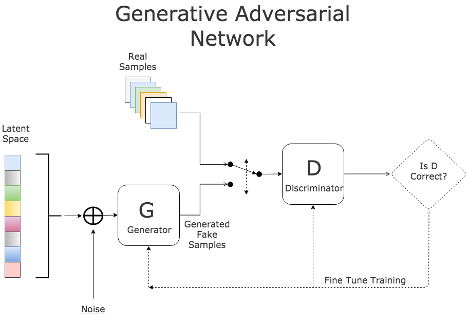
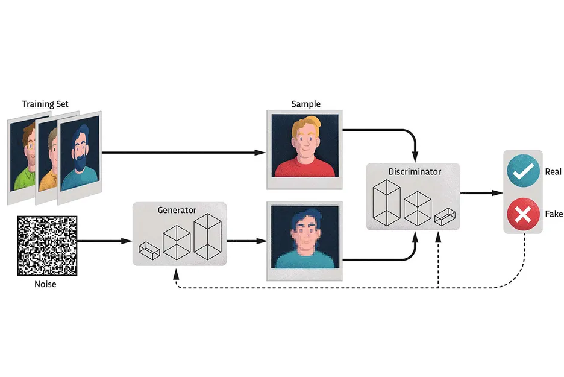

# Generative Adversarial Network (GAN)

Bu proje, Generative Adversarial Network (GAN) kullanarak yapay zeka tarafından yeni verilerin oluşturulmasını sağlar. GAN'lar, derin öğrenme alanında önemli bir yapay sinir ağı modelidir. 

## GAN Nedir?

Generative Adversarial Network (GAN), iki yapay sinir ağının birbirleriyle rekabet ettiği bir derin öğrenme modelidir. Bir ağ, gerçekçi veriler oluşturmayı öğrenirken, diğer ağ, bu üretilen verileri gerçek verilerden ayırt etmeyi öğrenir. Bu sürekli rekabet, her iki ağın da gelişmesine ve sonuç olarak daha gerçekçi veri üretilmesine yol açar.

